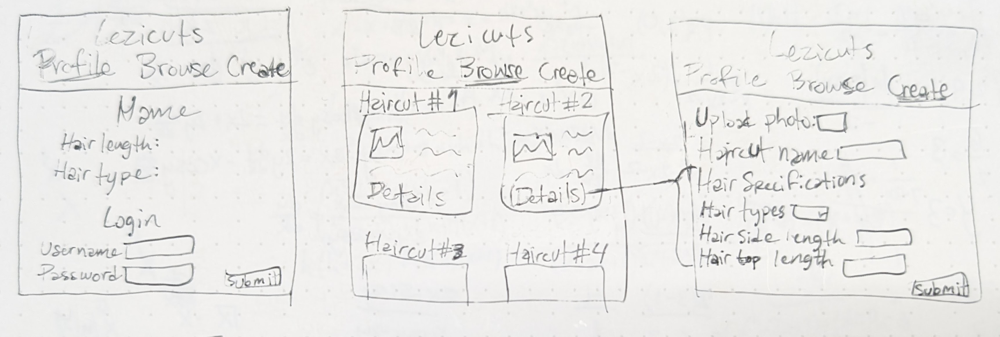

# Lezicuts

## Specification Deliverable

### Elevator Pitch
You know that feeling when you want to change your haircut but only have a picture of half of a guy's head to show the barber and have to hope the cut actually looks good on you? The Lezicuts application not only lets you keep track of your hair length, but also lets you browse haircuts with detailed specifications submitted by professional stylists and users alike so you can tell your barber exactly what you want!

### Design

This is a rough sketch of the web application design

### Key Features

- Hair-length tracker
- Profile
- Submit your own haircuts
- Browse haircuts

### Technologies

- **HTML:** A profile/login page, a browsing page, and a page for creating a submission
- **CSS:** For styling and an orderly and strightforward appearance
- **JavaScript:** For login, and haircut submission
- **Service:** Backend service with endpoints for login
- **DB/Login:** Store Haircut, user info in database
- **WebSocket:** Notifications when a new haircut is submitted
- **React:** Application ported to use the React web framework

## HTML Deliverable

For this deliverable I built the structure of my website using HTML in the following ways:

- **HTML Pages** - Three HTML pages for login and profile info, creating, and browsing haircuts
- **Links** - All three pages can access each other
- **Text** - Descriptions for each fill form and filler text for various haircuts
- **Images** - Filler images for each haircut
- **DB/Login** - Input boxes and submit buttons for login and haircut creation
- **WebSocket** - Placeholder for real-time notifcations

##CSS Deliverable

For this deliverable, I added style to the existing HTML elements

- **Header, footer, main** - Added bootstrap elements to header and main
- **Nav** - Added bootstrap navbar to header
- **Resizing** - Used flex and bootstrap for window resizing
- **Elements, text, and images** - Used a combination of bootstrap elements and CSS for elements, and changed the default font
